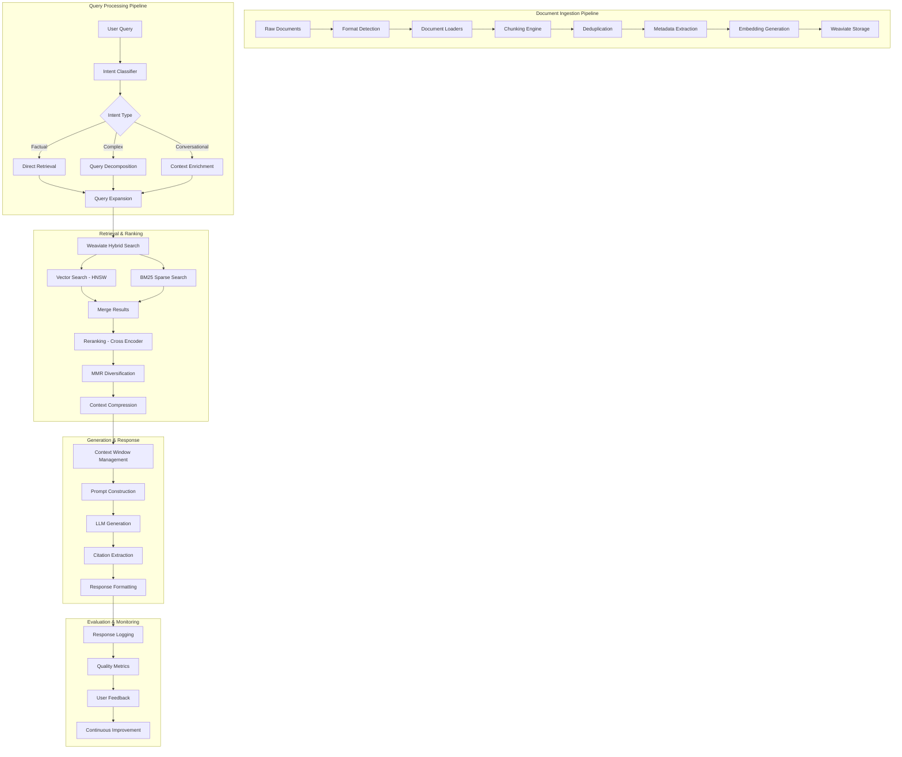
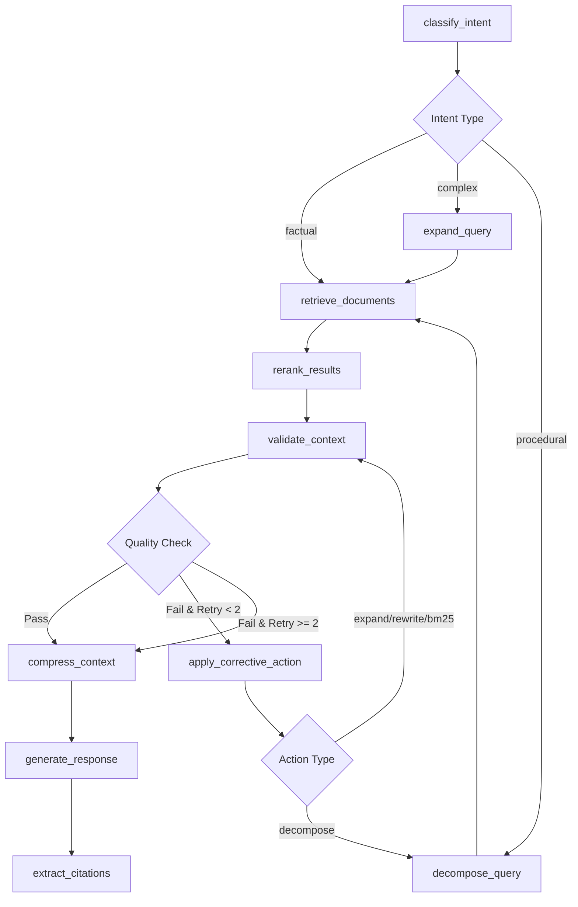

# Production-Grade RAG Chatbot with Self-Hosted Weaviate

Complete implementation plan for an enterprise RAG system with LangGraph orchestration, hybrid search, intelligent routing, and comprehensive evaluation.

## Architecture Overview



## Technology Stack

### Core Components
- **Orchestration**: LangGraph (state machine workflow)
- **Vector Database**: Weaviate (self-hosted, Docker)
- **LLM Framework**: LangChain + LangSmith (tracing)
- **Backend API**: FastAPI + Uvicorn
- **Embeddings**: OpenAI `text-embedding-3-large` or `sentence-transformers`
- **LLM**: OpenAI GPT-4 / Azure OpenAI / Claude / Llama (configurable)

### Supporting Libraries
- **Document Processing**: PyPDF2, pdfplumber, python-docx, openpyxl, pandas
- **Reranking**: sentence-transformers (cross-encoder)
- **Evaluation**: RAGAS, LangSmith
- **Monitoring**: Prometheus + Grafana (optional)

## Configuration Confirmed ✅

> [!NOTE]
> **LLM Provider: OpenAI**
> 
> Using OpenAI with the following configuration:
> - **Primary Model**: GPT-4-turbo (or GPT-4o for latest features)
> - **Fallback**: GPT-3.5-turbo (for cost optimization on simple queries)
> - **API**: OpenAI REST API
> - **Streaming**: Enabled for real-time responses

> [!NOTE]
> **Embedding Model: text-embedding-3-small**
> 
> Configuration:
> - **Dimensions**: 1536
> - **Cost**: $0.02 per 1M tokens (~$0.20 per 1M documents)
> - **Performance**: Excellent quality-to-cost ratio
> - **Batch Size**: 100 documents per API call (rate limiting)
> - **Caching**: Enabled to reduce redundant API calls

> [!NOTE]
> **Frontend Integration: Existing ChatSidebar.tsx**
> 
> Integration approach:
> - **Keep existing frontend** - No UI changes needed
> - **Backend compatibility** - New RAG backend will expose same API contract
> - **Gradual migration** - Can run both systems in parallel during transition
> - **API endpoints** - Match existing `/chat` endpoint signature
> 
> **Current frontend features to preserve**:
> - Chat history with sessions (Today/Yesterday/Older)
> - User authentication and admin features
> - Session management and deletion
> - "Others' Chats" view for admins
> - Real-time streaming responses

## Proposed Changes

### Phase 1: Infrastructure Setup

#### [NEW] `docker-compose.yml`

Complete Docker orchestration:
```yaml
services:
  weaviate:
    image: cr.weaviate.io/semitechnologies/weaviate:1.27.0
    ports:
      - "8080:8080"
      - "50051:50051"
    environment:
      QUERY_DEFAULTS_LIMIT: 25
      AUTHENTICATION_ANONYMOUS_ACCESS_ENABLED: 'true'
      PERSISTENCE_DATA_PATH: '/var/lib/weaviate'
      DEFAULT_VECTORIZER_MODULE: 'none'
      ENABLE_MODULES: 'text2vec-openai,generative-openai'
      CLUSTER_HOSTNAME: 'node1'
    volumes:
      - weaviate_data:/var/lib/weaviate
    restart: unless-stopped
    
  backend:
    build: ./backend
    ports:
      - "8000:8000"
    environment:
      WEAVIATE_URL: http://weaviate:8080
      OPENAI_API_KEY: ${OPENAI_API_KEY}
    depends_on:
      - weaviate
    volumes:
      - ./data:/app/data
    restart: unless-stopped
```

#### [NEW] [backend/Dockerfile`backend/Dockerfile)

Multi-stage production build:
- Stage 1: Build dependencies
- Stage 2: Runtime with minimal image
- Optimized layer caching

#### [NEW] [.env.example`.env.example)

Environment configuration template:
- API keys (OpenAI, Azure, etc.)
- Weaviate connection settings
- Feature flags
- Chunking parameters
- Retrieval hyperparameters

---

### Phase 2: Document Processing Pipeline

#### [NEW] [backend/src/document_loaders/`backend/src/document_loaders/)

Multi-format document loaders:

**[base_loader.py`backend/src/document_loaders/base_loader.py)**
- Abstract base class for all loaders
- Common interface: [load()`app/vectorstore.py#141-151), `extract_metadata()`
- Error handling and logging

**[pdf_loader.py`backend/src/document_loaders/pdf_loader.py)**
- PyPDF2 for text extraction
- pdfplumber for tables
- Metadata: page numbers, title, author, creation date

**[docx_loader.py`backend/src/document_loaders/docx_loader.py)**
- python-docx for DOCX files
- Preserve headers, lists, tables
- Extract comments and track changes

**[excel_loader.py`backend/src/document_loaders/excel_loader.py)**
- openpyxl for XLSX files
- Sheet-aware processing
- Convert tables to markdown format

**[markdown_loader.py`backend/src/document_loaders/markdown_loader.py)**
- Parse markdown with frontmatter
- Preserve structure (headers, code blocks)

**[transcript_loader.py`backend/src/document_loaders/transcript_loader.py)**
- VTT/SRT subtitle parsing
- Speaker diarization
- Timestamp preservation

**[jira_loader.py`backend/src/document_loaders/jira_loader.py)**
- Jira API integration
- Ticket fields: summary, description, comments
- Link relationships and attachments

#### [NEW] [backend/src/chunking/`backend/src/chunking/)

Advanced chunking strategies:

**[base_chunker.py`backend/src/chunking/base_chunker.py)**
- Abstract chunker interface
- Token counting utilities
- Overlap management

**[semantic_chunker.py`backend/src/chunking/semantic_chunker.py)**
- Sentence-transformer embeddings
- Cosine similarity threshold
- Groups semantically similar sentences
- Parameters: `similarity_threshold=0.7`, `min_chunk_size=100`

**[recursive_chunker.py`backend/src/chunking/recursive_chunker.py)**
- Hierarchical splitting: `\n\n` → `\n` → `. ` → ` `
- Configurable chunk size: 500-1000 tokens
- Overlap: 100-200 tokens (20%)
- Preserves paragraph boundaries

**[markdown_aware_chunker.py`backend/src/chunking/markdown_aware_chunker.py)**
- Respects markdown structure
- Keeps headers with content
- Preserves code blocks intact
- Table-aware splitting

**[code_chunker.py`backend/src/chunking/code_chunker.py)**
- Language-aware (Python, JS, Java, etc.)
- Function/class boundaries
- Preserve imports and context

**[adaptive_chunker.py`backend/src/chunking/adaptive_chunker.py)**
- Dynamic chunk sizing based on content type
- Dense content (code, tables): smaller chunks
- Narrative content: larger chunks
- Auto-selects best strategy per document

#### [NEW] [backend/src/deduplication.py`backend/src/deduplication.py)

Multi-level deduplication:
- **Exact duplicates**: MD5 hash comparison
- **Near-duplicates**: MinHash LSH (Locality Sensitive Hashing)
  - Jaccard similarity threshold: 0.85
  - Shingle size: 3-grams
- **Semantic duplicates**: Embedding cosine similarity > 0.95
- **Cross-document dedup**: Detect repeated content across sources

#### [NEW] [backend/src/metadata_extractor.py`backend/src/metadata_extractor.py)

Rich metadata extraction:
- **Universal**: source, doc_type, created_at, updated_at, chunk_index
- **PDF**: page_number, total_pages, author, title
- **DOCX**: section, heading_level, style
- **Excel**: sheet_name, row_range, column_headers
- **Jira**: ticket_key, status, priority, assignee, labels, sprint
- **Transcripts**: speaker, timestamp, duration
- **Blogs**: author, tags, category, publish_date

---

### Phase 3.5: Parent-Document Retrieval & Context Expansion ⭐ **CRITICAL**

#### [NEW] [backend/src/parent_doc/metadata_schema.py`backend/src/parent_doc/metadata_schema.py)

**Universal Chunk Identity Schema** - Consistent across all sources:

**Required Fields (All Chunks):**
```python
class UniversalChunkMetadata(BaseModel):
    # Source identification
    source_type: Literal["jira", "sharepoint", "blog", "pdf", "docx", "excel", "transcript"]
    
    # Parent document identity
    parent_id: str  # Stable UUID for parent document
    parent_key: str  # Path-like identifier (e.g., "sharepoint/limitations/policy.pdf")
    
    # Chunk identity
    chunk_id: int  # Order within parent scope (0..N)
    chunk_key: str  # Globally unique: parent_key + "#chunk_" + chunk_id
    chunk_role: Optional[str]  # "content" | "doc_summary" | "sheet_summary" | "ticket_summary"
    
    # Document metadata
    title: str
    url: str
    created_at: datetime
    updated_at: datetime
    
    # RBAC
    permissions: List[str]  # ["eng", "admin", "sales"]
    
    # Content
    content: str
    token_count: int
```

**Source-Specific Optional Fields:**
```python
# PDF/DOCX/SharePoint
class DocumentChunkMetadata(UniversalChunkMetadata):
    page_start: Optional[int]
    page_end: Optional[int]
    section_title: Optional[str]

# Blog/Markdown
class BlogChunkMetadata(UniversalChunkMetadata):
    heading_path: Optional[str]  # "Introduction > Setup > Installation"
    section_title: Optional[str]
    author: Optional[str]
    tags: Optional[List[str]]

# Transcript
class TranscriptChunkMetadata(UniversalChunkMetadata):
    speaker: Optional[str]
    t_start: Optional[float]  # Seconds from start
    t_end: Optional[float]

# Excel
class ExcelChunkMetadata(UniversalChunkMetadata):
    sheet_name: str
    sheet_id: int
    row_start: Optional[int]
    row_end: Optional[int]
    # Override chunk_key format: excel/<file>/sheet:<sheet>#chunk_002

# Jira
class JiraChunkMetadata(UniversalChunkMetadata):
    project_key: str
    issue_type: str
    status: str
    priority: str
    assignee: Optional[str]
    labels: Optional[List[str]]
```

**Parent Key Formats:**
```python
PARENT_KEY_FORMATS = {
    "sharepoint": "sharepoint/{folder}/{filename}",
    "blog": "blog/{slug}",
    "pdf": "pdf/{filename}",
    "docx": "docx/{filename}",
    "excel": "excel/{filename}",
    "transcript": "transcript/{filename_or_date}",
    "jira": "jira/{project}-{issue_number}"
}

# Examples:
# sharepoint/limitations/policy.pdf
# blog/migration_limitations
# jira/PROJ-123
# excel/limits.xlsx
# transcript/demo_call_2025-01-10
```

**Chunk Key Generation:**
```python
def generate_chunk_key(parent_key: str, chunk_id: int, sheet_name: str = None) -> str:
    """
    Generate globally unique chunk identifier.
    
    Examples:
    - sharepoint/limitations/policy.pdf#chunk_004
    - excel/limits.xlsx/sheet:Sheet1#chunk_002
    - jira/PROJ-123#summary
    """
    if sheet_name:
        return f"{parent_key}/sheet:{sheet_name}#chunk_{chunk_id:03d}"
    elif chunk_id == -1:
        return f"{parent_key}#summary"
    else:
        return f"{parent_key}#chunk_{chunk_id:03d}"
```

#### [NEW] [backend/src/parent_doc/summary_generator.py`backend/src/parent_doc/summary_generator.py)

**Summary Chunk Generation** - High-value context:

**Document Summary (PDF/DOCX/Blog/SharePoint):**
```python
def generate_document_summary(document: Document, chunks: List[Document]) -> Document:
    """
    Create a summary chunk for the entire document.
    
    Stored as:
    - chunk_id = -1
    - chunk_role = "doc_summary"
    - chunk_key = <parent_key>#summary
    """
    # Concatenate first 3 chunks + last chunk
    sample_content = "\n\n".join([
        chunks[0].page_content,
        chunks[1].page_content if len(chunks) > 1 else "",
        chunks[2].page_content if len(chunks) > 2 else "",
        chunks[-1].page_content if len(chunks) > 3 else ""
    ])
    
    # LLM summarization
    summary_prompt = f"""
    Summarize this document in 3-5 sentences. Focus on:
    - Main topic/purpose
    - Key points covered
    - Target audience or use case
    
    Document sample:
    {sample_content[:2000]}
    """
    
    summary = llm.invoke(summary_prompt).content
    
    return Document(
        page_content=summary,
        metadata={
            "chunk_id": -1,
            "chunk_role": "doc_summary",
            "chunk_key": f"{document.metadata['parent_key']}#summary",
            **document.metadata
        }
    )
```

**Sheet Summary (Excel):**
```python
def generate_sheet_summary(sheet_name: str, sheet_chunks: List[Document]) -> Document:
    """
    Create summary for each Excel sheet.
    
    chunk_key = excel/<file>/sheet:<sheet>#summary
    """
    # Extract column headers and sample rows
    headers = extract_headers(sheet_chunks[0])
    sample_rows = sheet_chunks[:3]
    
    summary_prompt = f"""
    Summarize this Excel sheet:
    Sheet: {sheet_name}
    Columns: {headers}
    Sample data: {sample_rows}
    
    Describe:
    - What data this sheet contains
    - Key columns and their purpose
    - Approximate row count
    """
    
    summary = llm.invoke(summary_prompt).content
    
    return Document(
        page_content=summary,
        metadata={
            "chunk_id": -1,
            "chunk_role": "sheet_summary",
            "chunk_key": f"{parent_key}/sheet:{sheet_name}#summary",
            "sheet_name": sheet_name
        }
    )
```

**Jira Ticket Summary:**
```python
def generate_jira_summary(ticket: JiraTicket) -> Document:
    """
    Create summary chunk for Jira ticket.
    """
    summary = f"""
    Ticket: {ticket.key}
    Status: {ticket.status}
    Priority: {ticket.priority}
    Summary: {ticket.summary}
    
    Description (first 200 chars): {ticket.description[:200]}...
    """
    
    return Document(
        page_content=summary,
        metadata={
            "chunk_id": -1,
            "chunk_role": "ticket_summary",
            "chunk_key": f"jira/{ticket.key}#summary"
        }
    )
```

#### [NEW] [backend/src/parent_doc/context_expander.py`backend/src/parent_doc/context_expander.py)

**Parent-Document Context Expansion** - Core retrieval enhancement:

```python
class ParentDocContextExpander:
    def __init__(self, weaviate_client, expand_k: int = 1, include_summary: bool = True):
        """
        Args:
            expand_k: Number of neighbor chunks to fetch on each side
            include_summary: Whether to include summary chunks
        """
        self.client = weaviate_client
        self.expand_k = expand_k
        self.include_summary = include_summary
    
    def expand_context(
        self, 
        retrieved_chunks: List[Document],
        user_permissions: List[str]
    ) -> List[Document]:
        """
        Expand context by fetching neighbor chunks from same parent.
        
        Flow:
        1. For each retrieved chunk, identify parent scope
        2. Fetch neighbor chunks (chunk_id ± expand_k)
        3. Fetch summary chunk if available
        4. Deduplicate and sort
        5. Apply RBAC filtering
        
        Returns:
            Expanded list of chunks with neighbors
        """
        expanded_chunks = []
        seen_chunk_keys = set()
        
        for chunk in retrieved_chunks:
            # Add original chunk
            if chunk.metadata["chunk_key"] not in seen_chunk_keys:
                expanded_chunks.append(chunk)
                seen_chunk_keys.add(chunk.metadata["chunk_key"])
            
            # Identify parent scope
            parent_scope = self._identify_parent_scope(chunk)
            
            # Fetch neighbors
            neighbors = self._fetch_neighbors(chunk, parent_scope, user_permissions)
            
            for neighbor in neighbors:
                if neighbor.metadata["chunk_key"] not in seen_chunk_keys:
                    expanded_chunks.append(neighbor)
                    seen_chunk_keys.add(neighbor.metadata["chunk_key"])
            
            # Fetch summary chunk
            if self.include_summary:
                summary = self._fetch_summary(chunk, parent_scope, user_permissions)
                if summary and summary.metadata["chunk_key"] not in seen_chunk_keys:
                    expanded_chunks.append(summary)
                    seen_chunk_keys.add(summary.metadata["chunk_key"])
        
        # Deduplicate and sort
        expanded_chunks = self._deduplicate_and_sort(expanded_chunks)
        
        return expanded_chunks
    
    def _identify_parent_scope(self, chunk: Document) -> Dict:
        """
        Identify the parent scope for neighbor fetching.
        
        Returns:
            {
                "parent_id": str,
                "sheet_name": str (for Excel),
                "scope_type": "document" | "sheet" | "transcript"
            }
        """
        source_type = chunk.metadata["source_type"]
        
        if source_type == "excel":
            return {
                "parent_id": chunk.metadata["parent_id"],
                "sheet_name": chunk.metadata["sheet_name"],
                "scope_type": "sheet"
            }
        elif source_type == "transcript":
            return {
                "parent_id": chunk.metadata["parent_id"],
                "t_start": chunk.metadata.get("t_start"),
                "t_end": chunk.metadata.get("t_end"),
                "scope_type": "transcript"
            }
        else:
            return {
                "parent_id": chunk.metadata["parent_id"],
                "scope_type": "document"
            }
    
    def _fetch_neighbors(
        self, 
        chunk: Document, 
        parent_scope: Dict,
        user_permissions: List[str]
    ) -> List[Document]:
        """
        Fetch neighbor chunks based on parent scope.
        """
        chunk_id = chunk.metadata["chunk_id"]
        neighbor_ids = range(
            max(0, chunk_id - self.expand_k),
            chunk_id + self.expand_k + 1
        )
        
        # Build Weaviate filter
        if parent_scope["scope_type"] == "sheet":
            # Excel: filter by parent_id AND sheet_name
            where_filter = {
                "operator": "And",
                "operands": [
                    {"path": ["parent_id"], "operator": "Equal", "valueText": parent_scope["parent_id"]},
                    {"path": ["sheet_name"], "operator": "Equal", "valueText": parent_scope["sheet_name"]},
                    {"path": ["chunk_id"], "operator": "ContainsAny", "valueInt": list(neighbor_ids)},
                    self._rbac_filter(user_permissions)
                ]
            }
        
        elif parent_scope["scope_type"] == "transcript":
            # Transcript: time-based expansion (±30 seconds)
            if parent_scope.get("t_start"):
                t_start = parent_scope["t_start"]
                where_filter = {
                    "operator": "And",
                    "operands": [
                        {"path": ["parent_id"], "operator": "Equal", "valueText": parent_scope["parent_id"]},
                        {"path": ["t_start"], "operator": "GreaterThanEqual", "valueNumber": t_start - 30},
                        {"path": ["t_end"], "operator": "LessThanEqual", "valueNumber": t_start + 30},
                        self._rbac_filter(user_permissions)
                    ]
                }
            else:
                # Fallback to chunk_id
                where_filter = {
                    "operator": "And",
                    "operands": [
                        {"path": ["parent_id"], "operator": "Equal", "valueText": parent_scope["parent_id"]},
                        {"path": ["chunk_id"], "operator": "ContainsAny", "valueInt": list(neighbor_ids)},
                        self._rbac_filter(user_permissions)
                    ]
                }
        
        else:
            # Document: filter by parent_id only
            where_filter = {
                "operator": "And",
                "operands": [
                    {"path": ["parent_id"], "operator": "Equal", "valueText": parent_scope["parent_id"]},
                    {"path": ["chunk_id"], "operator": "ContainsAny", "valueInt": list(neighbor_ids)},
                    self._rbac_filter(user_permissions)
                ]
            }
        
        # Query Weaviate
        collection = chunk.metadata["source_type"].capitalize()
        results = self.client.query.get(
            collection,
            ["content", "chunk_key", "chunk_id", "parent_key", "metadata_json"]
        ).with_where(where_filter).with_limit(self.expand_k * 2 + 1).do()
        
        return self._parse_weaviate_results(results)
    
    def _fetch_summary(
        self, 
        chunk: Document, 
        parent_scope: Dict,
        user_permissions: List[str]
    ) -> Optional[Document]:
        """
        Fetch summary chunk for parent document/sheet.
        """
        if parent_scope["scope_type"] == "sheet":
            # Sheet summary
            summary_key = f"{chunk.metadata['parent_key']}/sheet:{parent_scope['sheet_name']}#summary"
        else:
            # Document summary
            summary_key = f"{chunk.metadata['parent_key']}#summary"
        
        where_filter = {
            "operator": "And",
            "operands": [
                {"path": ["chunk_key"], "operator": "Equal", "valueText": summary_key},
                self._rbac_filter(user_permissions)
            ]
        }
        
        collection = chunk.metadata["source_type"].capitalize()
        results = self.client.query.get(
            collection,
            ["content", "chunk_key", "chunk_role", "metadata_json"]
        ).with_where(where_filter).with_limit(1).do()
        
        parsed = self._parse_weaviate_results(results)
        return parsed[0] if parsed else None
    
    def _rbac_filter(self, user_permissions: List[str]) -> Dict:
        """
        Create RBAC filter for Weaviate query.
        
        Returns filter that checks if user has ANY of the required permissions.
        """
        return {
            "path": ["permissions"],
            "operator": "ContainsAny",
            "valueText": user_permissions
        }
    
    def _deduplicate_and_sort(self, chunks: List[Document]) -> List[Document]:
        """
        Deduplicate by chunk_key and sort by:
        1. parent_key
        2. sheet_name (if Excel)
        3. chunk_id
        """
        # Deduplicate
        unique_chunks = {chunk.metadata["chunk_key"]: chunk for chunk in chunks}
        chunks = list(unique_chunks.values())
        
        # Sort
        def sort_key(chunk):
            return (
                chunk.metadata["parent_key"],
                chunk.metadata.get("sheet_name", ""),
                chunk.metadata["chunk_id"]
            )
        
        chunks.sort(key=sort_key)
        
        return chunks
    
    def _parse_weaviate_results(self, results: Dict) -> List[Document]:
        """Parse Weaviate query results into Document objects."""
        # Implementation depends on Weaviate response format
        pass
```

**Integration with Retrieval Pipeline:**
```python
# Updated retrieval flow
def retrieve_with_parent_expansion(
    query: str,
    collections: List[str],
    user_permissions: List[str],
    top_k: int = 10,
    expand_k: int = 1
) -> List[Document]:
    """
    Complete retrieval flow with parent-document expansion.
    
    Steps:
    1. Hybrid search across collections
    2. RBAC filtering
    3. Reranking
    4. CRAG validation
    5. Parent-document expansion ⭐ NEW
    6. Deduplication and sorting
    7. Token budget management
    """
    # 1. Hybrid search
    retrieved_chunks = hybrid_search(
        query=query,
        collections=collections,
        top_k=top_k,
        user_permissions=user_permissions
    )
    
    # 2. Reranking
    reranked_chunks = rerank(query, retrieved_chunks)
    
    # 3. CRAG validation
    validation = crag_validator.validate(query, reranked_chunks)
    if validation.quality_score < 0.7:
        # Apply corrective action...
        pass
    
    # 4. Parent-document expansion ⭐
    expander = ParentDocContextExpander(
        weaviate_client=client,
        expand_k=expand_k,
        include_summary=True
    )
    expanded_chunks = expander.expand_context(reranked_chunks, user_permissions)
    
    # 5. Token budget management
    final_chunks = apply_token_budget(expanded_chunks, max_tokens=4000)
    
    return final_chunks
```

**Citation Format:**
```python
def format_citation(chunk: Document) -> str:
    """
    Generate citation string for chunk.
    
    Examples:
    - [source: sharepoint/limitations/policy.pdf chunk_004]
    - [source: excel/limits.xlsx Sheet1 chunk_002]
    - [source: jira/PROJ-123 summary]
    - [source: transcript/demo_call_2025-01-10 chunk_012 (speaker: John, 02:15)]
    """
    source_type = chunk.metadata["source_type"]
    parent_key = chunk.metadata["parent_key"]
    chunk_id = chunk.metadata["chunk_id"]
    
    if source_type == "excel":
        sheet = chunk.metadata["sheet_name"]
        return f"[source: {parent_key} {sheet} chunk_{chunk_id:03d}]"
    
    elif source_type == "transcript":
        speaker = chunk.metadata.get("speaker", "Unknown")
        t_start = chunk.metadata.get("t_start", 0)
        minutes = int(t_start // 60)
        seconds = int(t_start % 60)
        return f"[source: {parent_key} chunk_{chunk_id:03d} (speaker: {speaker}, {minutes:02d}:{seconds:02d})]"
    
    elif chunk_id == -1:
        return f"[source: {parent_key} summary]"
    
    else:
        return f"[source: {parent_key} chunk_{chunk_id:03d}]"
```

**Logging & Monitoring:**
```python
def log_retrieval_expansion(
    query: str,
    retrieved_chunks: List[Document],
    expanded_chunks: List[Document],
    final_chunks: List[Document]
):
    """
    Log retrieval and expansion for debugging and metrics.
    """
    logger.info(f"Query: {query}")
    logger.info(f"Initial retrieval: {len(retrieved_chunks)} chunks")
    logger.info(f"After expansion: {len(expanded_chunks)} chunks")
    logger.info(f"After token budget: {len(final_chunks)} chunks")
    
    logger.debug("Retrieved chunk keys:")
    for chunk in retrieved_chunks:
        logger.debug(f"  - {chunk.metadata['chunk_key']}")
    
    logger.debug("Expanded chunk keys:")
    for chunk in expanded_chunks:
        logger.debug(f"  - {chunk.metadata['chunk_key']}")
```

---

### Phase 3: Weaviate Schema & Configuration

#### [NEW] [backend/src/weaviate_client.py`backend/src/weaviate_client.py)

Weaviate client initialization:
- Connection management with retry logic
- Health checks and readiness probes
- Batch import configuration
- Error handling and logging

#### [NEW] [backend/src/weaviate_schema.py`backend/src/weaviate_schema.py)

Schema definition for knowledge branches:

**Collections (Multi-tenant namespaces):**
1. **`Blogs`** - Company blog posts
2. **`InternalDocs`** - Internal documentation
3. **`Spreadsheets`** - Excel reports and data
4. **`Transcripts`** - Demo recordings and meetings
5. **`JiraTickets`** - Jira issues and comments
6. **`PDFs`** - PDF documents
7. **`GeneralKnowledge`** - Miscellaneous documents

**Schema per collection:**
```python
{
    "class": "Blogs",
    "vectorizer": "none",  # We provide embeddings
    "vectorIndexType": "hnsw",
    "vectorIndexConfig": {
        "ef": 64,              # Higher = better recall, slower
        "efConstruction": 128, # Build quality
        "maxConnections": 32,  # Graph connectivity
        "distance": "cosine"
    },
    "properties": [
        # Content
        {"name": "content", "dataType": ["text"]},
        
        # Universal parent-document fields ⭐
        {"name": "source_type", "dataType": ["text"]},  # jira|sharepoint|blog|pdf|docx|excel|transcript
        {"name": "parent_id", "dataType": ["text"]},    # UUID
        {"name": "parent_key", "dataType": ["text"]},   # sharepoint/limitations/policy.pdf
        {"name": "chunk_id", "dataType": ["int"]},      # 0..N (or -1 for summary)
        {"name": "chunk_key", "dataType": ["text"]},    # parent_key#chunk_004
        {"name": "chunk_role", "dataType": ["text"]},   # content|doc_summary|sheet_summary
        
        # Document metadata
        {"name": "title", "dataType": ["text"]},
        {"name": "url", "dataType": ["text"]},
        {"name": "created_at", "dataType": ["date"]},
        {"name": "updated_at", "dataType": ["date"]},
        
        # RBAC
        {"name": "permissions", "dataType": ["text[]"]},  # ["eng", "admin"]
        
        # Token count
        {"name": "token_count", "dataType": ["int"]},
        
        # Collection-specific fields
        {"name": "author", "dataType": ["text"]},
        {"name": "tags", "dataType": ["text[]"]},
        {"name": "category", "dataType": ["text"]},
        {"name": "heading_path", "dataType": ["text"]},  # "Intro > Setup > Install"
        {"name": "section_title", "dataType": ["text"]},
    ]
}
```

**Excel collection (special handling):**
```python
{
    "class": "Spreadsheets",
    "properties": [
        # ... all universal fields above ...
        
        # Excel-specific
        {"name": "sheet_name", "dataType": ["text"]},
        {"name": "sheet_id", "dataType": ["int"]},
        {"name": "row_start", "dataType": ["int"]},
        {"name": "row_end", "dataType": ["int"]},
        # chunk_key format: excel/limits.xlsx/sheet:Sheet1#chunk_002
    ]
}
```

**Transcript collection:**
```python
{
    "class": "Transcripts",
    "properties": [
        # ... all universal fields above ...
        
        # Transcript-specific
        {"name": "speaker", "dataType": ["text"]},
        {"name": "t_start", "dataType": ["number"]},  # Seconds from start
        {"name": "t_end", "dataType": ["number"]},
    ]
}
```

**Jira collection:**
```python
{
    "class": "JiraTickets",
    "properties": [
        # ... all universal fields above ...
        
        # Jira-specific
        {"name": "project_key", "dataType": ["text"]},
        {"name": "issue_type", "dataType": ["text"]},
        {"name": "status", "dataType": ["text"]},
        {"name": "priority", "dataType": ["text"]},
        {"name": "assignee", "dataType": ["text"]},
        {"name": "labels", "dataType": ["text[]"]},
    ]
}
```

**HNSW Tuning:**
- `ef`: Query-time search depth (32-512, default 64)
- `efConstruction`: Build-time quality (64-512, default 128)
- `maxConnections`: Graph edges per node (16-64, default 32)
- **Trade-off**: Higher values = better recall, more memory, slower queries

---

### Phase 4: Hybrid Search Implementation

#### [NEW] [backend/src/retrieval/hybrid_search.py`backend/src/retrieval/hybrid_search.py)

Weaviate native hybrid search:
```python
def hybrid_search(query: str, collection: str, top_k: int = 50, alpha: float = 0.7):
    """
    Weaviate hybrid search combining vector + BM25.
    
    Args:
        query: Search query
        collection: Weaviate collection name
        top_k: Number of results
        alpha: Vector weight (0=BM25 only, 1=vector only, 0.7=balanced)
    
    Returns:
        List of documents with scores
    """
    results = client.query.get(
        collection,
        ["content", "source", "metadata_json"]
    ).with_hybrid(
        query=query,
        alpha=alpha,  # 0.7 = 70% vector, 30% BM25
        fusion_type="relativeScoreFusion"  # or "rankedFusion"
    ).with_limit(top_k).do()
    
    return results
```

**Fusion strategies:**
- `relativeScoreFusion`: Normalize scores, then combine
- `rankedFusion`: Reciprocal Rank Fusion (RRF)

**Alpha tuning:**
- `0.0`: Pure BM25 (keyword matching)
- `0.5`: Balanced hybrid
- `0.7`: Favor semantic (recommended)
- `1.0`: Pure vector search

#### [NEW] [backend/src/retrieval/multi_collection_search.py`backend/src/retrieval/multi_collection_search.py)

Search across knowledge branches:
- Route query to relevant collections based on intent
- Parallel search across multiple collections
- Merge and deduplicate results
- Collection-specific filtering

---

### Phase 5: Query Processing & Intent Classification

#### [NEW] [backend/src/query_processing/intent_classifier.py`backend/src/query_processing/intent_classifier.py)

LLM-based intent classification:

**Intent categories:**
1. **`factual_qa`**: Direct factual questions
   - Example: "What is the API rate limit?"
   - Strategy: Direct retrieval, top-k=5
   
2. **`procedural`**: How-to questions
   - Example: "How do I deploy the application?"
   - Strategy: Sequential retrieval, favor docs
   
3. **`troubleshooting`**: Debug/fix issues
   - Example: "Why is my build failing?"
   - Strategy: Search Jira + docs, recent first
   
4. **`exploratory`**: Open-ended research
   - Example: "Tell me about our authentication system"
   - Strategy: Broad retrieval, top-k=20, MMR
   
5. **`comparison`**: Compare options
   - Example: "Difference between REST and GraphQL?"
   - Strategy: Retrieve both topics, structured comparison
   
6. **`conversational`**: Follow-up questions
   - Example: "What about the other one?"
   - Strategy: Use conversation history, context enrichment

**Classification prompt:**
```python
INTENT_CLASSIFICATION_PROMPT = """
Classify the user's query into one of these intents:
- factual_qa: Direct factual question
- procedural: How-to or step-by-step question
- troubleshooting: Debugging or error resolution
- exploratory: Open-ended research
- comparison: Comparing options or approaches
- conversational: Follow-up or contextual question

Query: {query}
Conversation history: {history}

Respond with JSON:
{
  "intent": "factual_qa",
  "confidence": 0.95,
  "reasoning": "User asks a direct question about a specific fact",
  "suggested_collections": ["InternalDocs", "Blogs"]
}
"""
```

#### [NEW] [backend/src/query_processing/query_expander.py`backend/src/query_processing/query_expander.py)

Query expansion techniques:
- **Synonym expansion**: "API" → "API, REST API, endpoint, web service"
- **Acronym expansion**: "K8s" → "Kubernetes"
- **LLM-based expansion**: Generate related queries
- **HyDE (Hypothetical Document Embeddings)**: Generate hypothetical answer, embed it

#### [NEW] [backend/src/query_processing/query_decomposer.py`backend/src/query_processing/query_decomposer.py)

Complex query decomposition:
- Break multi-part questions into sub-queries
- Example: "How do I deploy and monitor the app?" → 
  - Sub-query 1: "How to deploy the application"
  - Sub-query 2: "How to monitor the application"
- Execute sub-queries in parallel or sequence
- Merge results intelligently

#### [NEW] [backend/src/query_processing/context_manager.py`backend/src/query_processing/context_manager.py)

Conversation context management:
- Maintain conversation history
- Coreference resolution: "it", "that", "the previous one"
- Context window management (sliding window)
- Session state persistence

---

### Phase 6: Reranking & Result Refinement

#### [NEW] [backend/src/reranking/cross_encoder_reranker.py`backend/src/reranking/cross_encoder_reranker.py)

Cross-encoder reranking:
- Model: `cross-encoder/ms-marco-MiniLM-L-12-v2`
- Input: (query, document) pairs
- Output: Relevance score (0-1)
- Rerank top-50 → select top-10
- Significantly improves precision

**Pipeline:**
1. Hybrid search retrieves top-50 candidates
2. Cross-encoder scores each (query, doc) pair
3. Sort by cross-encoder score
4. Return top-10 most relevant

#### [NEW] [backend/src/reranking/mmr_diversifier.py`backend/src/reranking/mmr_diversifier.py)

Maximal Marginal Relevance (MMR):
- Balance relevance vs. diversity
- Avoid redundant results
- Formula: `MMR = λ * Sim(q, d) - (1-λ) * max(Sim(d, d_i))`
- Lambda: 0.7 (70% relevance, 30% diversity)

#### [NEW] [backend/src/reranking/context_compressor.py`backend/src/reranking/context_compressor.py)

Contextual compression:
- Remove irrelevant sentences from retrieved chunks
- LLM-based extraction of relevant passages
- Reduce context window usage
- Improve signal-to-noise ratio

---

### Phase 6.5: CRAG - Retrieval Adequacy Check ⭐ **CRITICAL**

#### [NEW] [backend/src/retrieval/crag_validator.py`backend/src/retrieval/crag_validator.py)

**CRAG (Corrective Retrieval Augmented Generation)** - Quality gate before generation:

**Context Quality Scoring:**
```python
def validate_retrieval_quality(query: str, retrieved_docs: List[Document]) -> ValidationResult:
    """
    Assess retrieval quality and trigger corrective actions if needed.
    
    Checks:
    1. Relevance: Are docs actually relevant to the query?
    2. Coverage: Is there enough information to answer?
    3. Diversity: Are results redundant/duplicates?
    4. Confidence: How confident are we in these results?
    
    Returns:
        ValidationResult with quality_score, issues, and recommended_action
    """
```

**Quality Checks:**

1. **Relevance Check** (LLM-based grading)
   - Prompt: "On a scale of 1-5, how relevant is this document to the query?"
   - Threshold: Average score > 3.5
   - If failed: Trigger corrective retrieval

2. **Coverage Check**
   - Token count: Minimum 200 tokens of context
   - Document count: At least 3 relevant documents
   - If failed: Expand retrieval (increase top-k)

3. **Diversity Check**
   - Semantic similarity between retrieved docs
   - If >80% similar: Too redundant, expand search
   - Use MMR to ensure diverse perspectives

4. **Confidence Scoring**
   - Combine retrieval scores + relevance grades
   - Threshold: Confidence > 0.7
   - If low: Trigger query reformulation

**Corrective Actions:**

```python
class CorrectiveAction(Enum):
    ACCEPT = "accept"                    # Quality sufficient, proceed
    EXPAND_TOPK = "expand_topk"          # Retrieve more documents (top-k: 50→100)
    INCREASE_BM25 = "increase_bm25"      # Shift to keyword search (alpha: 0.7→0.4)
    REWRITE_QUERY = "rewrite_query"      # Reformulate query with LLM
    DECOMPOSE_QUERY = "decompose_query"  # Break into sub-queries
    WEB_SEARCH = "web_search"            # Fallback to external search (optional)
    ASK_CLARIFICATION = "ask_clarification"  # Request user clarification
```

**Decision Logic:**
```python
def determine_corrective_action(validation: ValidationResult) -> CorrectiveAction:
    if validation.quality_score > 0.8:
        return CorrectiveAction.ACCEPT
    
    if validation.issues.get("low_relevance"):
        # Docs exist but off-topic → try keyword search
        return CorrectiveAction.INCREASE_BM25
    
    if validation.issues.get("insufficient_coverage"):
        # Not enough docs → get more
        return CorrectiveAction.EXPAND_TOPK
    
    if validation.issues.get("high_redundancy"):
        # All docs say same thing → reformulate
        return CorrectiveAction.REWRITE_QUERY
    
    if validation.issues.get("ambiguous_query"):
        # Query unclear → ask user
        return CorrectiveAction.ASK_CLARIFICATION
    
    # Default: try query decomposition
    return CorrectiveAction.DECOMPOSE_QUERY
```

**Fallback Strategies:**

1. **Expand Top-K**: Retrieve 100 instead of 50, rerank again
2. **Adjust Hybrid Alpha**: 
   - If semantic search fails → increase BM25 (alpha: 0.7 → 0.3)
   - If keyword search fails → increase vector (alpha: 0.3 → 0.9)
3. **Query Rewriting**: LLM generates alternative phrasings
4. **Query Decomposition**: Break complex query into simpler parts
5. **Clarification Questions**: Ask user for more context

**Implementation:**
```python
class CRAGValidator:
    def __init__(self, llm, relevance_threshold=3.5, min_docs=3, min_tokens=200):
        self.llm = llm
        self.relevance_threshold = relevance_threshold
        self.min_docs = min_docs
        self.min_tokens = min_tokens
    
    def validate(self, query: str, docs: List[Document]) -> ValidationResult:
        # 1. Check relevance
        relevance_scores = self._grade_relevance(query, docs)
        avg_relevance = sum(relevance_scores) / len(relevance_scores)
        
        # 2. Check coverage
        total_tokens = sum(len(doc.page_content.split()) for doc in docs)
        sufficient_coverage = total_tokens >= self.min_tokens and len(docs) >= self.min_docs
        
        # 3. Check diversity
        diversity_score = self._calculate_diversity(docs)
        
        # 4. Calculate overall quality
        quality_score = (
            0.5 * (avg_relevance / 5.0) +  # Normalize to 0-1
            0.3 * (1.0 if sufficient_coverage else 0.5) +
            0.2 * diversity_score
        )
        
        # 5. Identify issues
        issues = {}
        if avg_relevance < self.relevance_threshold:
            issues["low_relevance"] = True
        if not sufficient_coverage:
            issues["insufficient_coverage"] = True
        if diversity_score < 0.5:
            issues["high_redundancy"] = True
        
        return ValidationResult(
            quality_score=quality_score,
            relevance_scores=relevance_scores,
            coverage_sufficient=sufficient_coverage,
            diversity_score=diversity_score,
            issues=issues
        )
    
    def _grade_relevance(self, query: str, docs: List[Document]) -> List[float]:
        """LLM-based relevance grading (1-5 scale)"""
        prompt = f"""
        Query: {query}
        
        Document: {{doc_content}}
        
        Rate the relevance of this document to the query on a scale of 1-5:
        1 = Completely irrelevant
        2 = Slightly relevant
        3 = Moderately relevant
        4 = Very relevant
        5 = Perfectly relevant
        
        Respond with ONLY a number (1-5).
        """
        
        scores = []
        for doc in docs:
            response = self.llm.invoke(prompt.format(doc_content=doc.page_content[:500]))
            score = float(response.content.strip())
            scores.append(score)
        
        return scores
    
    def _calculate_diversity(self, docs: List[Document]) -> float:
        """Calculate semantic diversity (1 - avg_similarity)"""
        if len(docs) < 2:
            return 1.0
        
        embeddings = [get_embedding(doc.page_content) for doc in docs]
        similarities = []
        
        for i in range(len(embeddings)):
            for j in range(i + 1, len(embeddings)):
                sim = cosine_similarity(embeddings[i], embeddings[j])
                similarities.append(sim)
        
        avg_similarity = sum(similarities) / len(similarities)
        return 1.0 - avg_similarity  # Higher diversity = lower similarity
```

**Integration with Retrieval Pipeline:**
```python
# After reranking, before generation
validation = crag_validator.validate(query, reranked_docs)

if validation.quality_score < 0.7:
    # Trigger corrective action
    action = determine_corrective_action(validation)
    
    if action == CorrectiveAction.EXPAND_TOPK:
        # Retrieve more documents
        expanded_docs = hybrid_search(query, top_k=100)
        reranked_docs = rerank(expanded_docs)
        validation = crag_validator.validate(query, reranked_docs)
    
    elif action == CorrectiveAction.INCREASE_BM25:
        # Shift to keyword-heavy search
        docs = hybrid_search(query, top_k=50, alpha=0.3)  # More BM25
        reranked_docs = rerank(docs)
        validation = crag_validator.validate(query, reranked_docs)
    
    elif action == CorrectiveAction.REWRITE_QUERY:
        # Reformulate query
        rewritten_query = query_rewriter.rewrite(query)
        docs = hybrid_search(rewritten_query, top_k=50)
        reranked_docs = rerank(docs)
        validation = crag_validator.validate(rewritten_query, reranked_docs)
    
    elif action == CorrectiveAction.ASK_CLARIFICATION:
        # Return clarification request to user
        return {
            "type": "clarification_needed",
            "message": "Could you provide more details about what you're looking for?",
            "suggestions": generate_clarification_questions(query)
        }

# Proceed with generation only if quality is acceptable
if validation.quality_score >= 0.7:
    response = generate_response(query, reranked_docs)
else:
    # Last resort: acknowledge limitation
    response = "I couldn't find sufficient information to answer your question confidently. Could you rephrase or provide more context?"
```

**Monitoring & Metrics:**
- Track validation pass rate
- Log corrective actions taken
- Measure quality improvement after corrections
- A/B test: with vs. without CRAG

---

### Phase 7: LangGraph Orchestration

#### [NEW] [backend/src/langgraph_workflow/`backend/src/langgraph_workflow/)

State machine workflow:

**[state.py`backend/src/langgraph_workflow/state.py)**
```python
class RAGState(TypedDict):
    query: str
    conversation_history: List[Message]
    intent: str
    intent_confidence: float
    expanded_queries: List[str]
    sub_queries: List[str]
    retrieved_docs: List[Document]
    reranked_docs: List[Document]
    # CRAG validation
    validation_result: ValidationResult
    corrective_action: str
    retrieval_attempt: int  # Track retry attempts
    # Generation
    compressed_context: str
    generated_response: str
    citations: List[str]
    metadata: Dict
```

**[nodes.py`backend/src/langgraph_workflow/nodes.py)**

Workflow nodes:
1. **`classify_intent`**: Determine query intent
2. **`expand_query`**: Generate related queries
3. **`decompose_query`**: Break into sub-queries (if complex)
4. **`retrieve_documents`**: Hybrid search
5. **`rerank_results`**: Cross-encoder reranking
6. **`validate_context`**: ⭐ **CRAG quality check** (NEW)
7. **`apply_corrective_action`**: Execute fallback strategy (NEW)
8. **`compress_context`**: Remove irrelevant content
9. **`generate_response`**: LLM generation
10. **`extract_citations`**: Add source references
11. **`self_evaluate`**: Quality check (optional)

**New Node: validate_context**
```python
def validate_context(state: RAGState) -> RAGState:
    """
    CRAG-style retrieval adequacy check.
    Validates if retrieved context is sufficient for generation.
    """
    validator = CRAGValidator(llm=llm)
    
    validation = validator.validate(
        query=state["query"],
        docs=state["reranked_docs"]
    )
    
    state["validation_result"] = validation
    
    # Determine corrective action if quality is low
    if validation.quality_score < 0.7 and state["retrieval_attempt"] < 2:
        action = determine_corrective_action(validation)
        state["corrective_action"] = action
    else:
        state["corrective_action"] = "accept"
    
    return state
```

**New Node: apply_corrective_action**
```python
def apply_corrective_action(state: RAGState) -> RAGState:
    """
    Execute corrective retrieval strategy based on validation.
    """
    action = state["corrective_action"]
    state["retrieval_attempt"] += 1
    
    if action == "expand_topk":
        # Retrieve more documents
        docs = hybrid_search(state["query"], top_k=100, alpha=0.7)
        state["retrieved_docs"] = docs
        state["reranked_docs"] = rerank(docs)
    
    elif action == "increase_bm25":
        # Shift to keyword-heavy search
        docs = hybrid_search(state["query"], top_k=50, alpha=0.3)
        state["retrieved_docs"] = docs
        state["reranked_docs"] = rerank(docs)
    
    elif action == "rewrite_query":
        # Reformulate query
        rewritten = query_rewriter.rewrite(state["query"])
        docs = hybrid_search(rewritten, top_k=50, alpha=0.7)
        state["retrieved_docs"] = docs
        state["reranked_docs"] = rerank(docs)
        state["query"] = rewritten  # Update query
    
    elif action == "decompose_query":
        # Break into sub-queries
        sub_queries = decompose_query(state["query"])
        state["sub_queries"] = sub_queries
        # Will be handled by decompose_query node
    
    return state
```

**[edges.py`backend/src/langgraph_workflow/edges.py)**

Conditional routing:
```python
def route_by_intent(state: RAGState) -> str:
    if state["intent"] == "factual_qa":
        return "direct_retrieval"
    elif state["intent"] in ["exploratory", "comparison"]:
        return "expand_query"
    elif state["intent"] == "procedural":
        return "decompose_query"
    else:
        return "direct_retrieval"

def route_after_validation(state: RAGState) -> str:
    """
    CRAG routing: decide whether to proceed or apply corrections.
    """
    action = state["corrective_action"]
    
    if action == "accept":
        # Quality sufficient, proceed to generation
        return "compress_context"
    elif state["retrieval_attempt"] >= 2:
        # Max retries reached, proceed anyway with disclaimer
        return "compress_context"
    else:
        # Apply corrective action and re-validate
        return "apply_corrective_action"

def route_after_correction(state: RAGState) -> str:
    """
    After applying correction, re-validate or decompose.
    """
    if state["corrective_action"] == "decompose_query":
        return "decompose_query"
    else:
        # Re-validate after correction
        return "validate_context"
```

**[workflow.py`backend/src/langgraph_workflow/workflow.py)**

Complete workflow graph with CRAG:
```python
workflow = StateGraph(RAGState)

# Add nodes
workflow.add_node("classify_intent", classify_intent)
workflow.add_node("expand_query", expand_query)
workflow.add_node("decompose_query", decompose_query)
workflow.add_node("retrieve_documents", retrieve_documents)
workflow.add_node("rerank_results", rerank_results)
workflow.add_node("validate_context", validate_context)  # ⭐ CRAG
workflow.add_node("apply_corrective_action", apply_corrective_action)  # ⭐ CRAG
workflow.add_node("compress_context", compress_context)
workflow.add_node("generate_response", generate_response)
workflow.add_node("extract_citations", extract_citations)

# Add edges
workflow.set_entry_point("classify_intent")
workflow.add_conditional_edges("classify_intent", route_by_intent)
workflow.add_edge("expand_query", "retrieve_documents")
workflow.add_edge("decompose_query", "retrieve_documents")
workflow.add_edge("retrieve_documents", "rerank_results")

# ⭐ CRAG validation loop
workflow.add_edge("rerank_results", "validate_context")
workflow.add_conditional_edges("validate_context", route_after_validation, {
    "compress_context": "compress_context",
    "apply_corrective_action": "apply_corrective_action"
})
workflow.add_conditional_edges("apply_corrective_action", route_after_correction, {
    "validate_context": "validate_context",
    "decompose_query": "decompose_query"
})

# Generation pipeline
workflow.add_edge("compress_context", "generate_response")
workflow.add_edge("generate_response", "extract_citations")
workflow.set_finish_point("extract_citations")

app = workflow.compile()
```

**Workflow Diagram with CRAG:**


---

### Phase 8: Prompt Engineering & Context Management

#### [NEW] [backend/src/prompts/system_prompts.py`backend/src/prompts/system_prompts.py)

Optimized system prompts:

**Base system prompt:**
```python
SYSTEM_PROMPT = """
You are an expert AI assistant for [Organization Name] with deep knowledge of our internal systems, processes, and documentation.

Your role:
- Answer questions accurately using the provided context
- Cite sources for all factual claims
- Admit when you don't know something
- Provide step-by-step guidance for procedural questions
- Suggest related resources when helpful

Guidelines:
- ALWAYS cite sources using [Source: filename] format
- If context is insufficient, say so clearly
- For code examples, use proper formatting
- For troubleshooting, provide systematic debugging steps
- Maintain a professional, helpful tone

Context will be provided below. Use ONLY this context to answer.
"""
```

**Intent-specific prompts:**
- Factual: Emphasize accuracy and citations
- Procedural: Step-by-step format
- Troubleshooting: Diagnostic approach
- Exploratory: Comprehensive overview

#### [NEW] [backend/src/prompts/context_window_manager.py`backend/src/prompts/context_window_manager.py)

Context window optimization:
- **Token counting**: tiktoken for accurate counts
- **Sliding window**: Keep recent N messages
- **Context prioritization**:
  1. Current query (highest priority)
  2. Most relevant retrieved chunks
  3. Recent conversation history
  4. System prompt
- **Truncation strategy**: Remove oldest history first
- **Target**: 70% of max context (leave room for response)

**Token budgets (GPT-4 example, 8K context):**
- System prompt: 500 tokens
- Retrieved context: 4000 tokens (5-10 chunks)
- Conversation history: 1500 tokens (last 5-10 turns)
- User query: 200 tokens
- Reserved for response: 1800 tokens

#### [NEW] [backend/src/prompts/few_shot_examples.py`backend/src/prompts/few_shot_examples.py)

Domain-specific few-shot examples:
- Example Q&A pairs for each intent type
- Demonstrates proper citation format
- Shows desired response structure
- Improves consistency

---

### Phase 9: Evaluation Framework

#### [NEW] [backend/src/evaluation/`backend/src/evaluation/)

Comprehensive evaluation:

**[retrieval_metrics.py`backend/src/evaluation/retrieval_metrics.py)**

Retrieval quality metrics:
- **Precision@k**: Relevant docs in top-k / k
- **Recall@k**: Relevant docs in top-k / total relevant
- **MRR (Mean Reciprocal Rank)**: 1 / rank of first relevant doc
- **NDCG (Normalized Discounted Cumulative Gain)**: Ranked relevance
- **Context Relevance**: LLM-scored relevance of retrieved chunks

**[generation_metrics.py`backend/src/evaluation/generation_metrics.py)**

Generation quality metrics:
- **Faithfulness**: Answer grounded in context (no hallucination)
- **Answer Relevance**: Response addresses the question
- **Semantic Similarity**: Cosine similarity to ground truth
- **Citation Accuracy**: Sources properly attributed

**[ragas_integration.py`backend/src/evaluation/ragas_integration.py)**

RAGAS framework integration:
```python
from ragas import evaluate
from ragas.metrics import (
    faithfulness,
    answer_relevancy,
    context_precision,
    context_recall,
)

def evaluate_rag_pipeline(test_set):
    results = evaluate(
        test_set,
        metrics=[
            faithfulness,
            answer_relevancy,
            context_precision,
            context_recall,
        ]
    )
    return results
```

**[test_set_builder.py`backend/src/evaluation/test_set_builder.py)**

Create evaluation datasets:
- Synthetic question generation from documents
- Manual curation of Q&A pairs
- Ground truth annotation
- Diverse query types (factual, procedural, etc.)

**[continuous_evaluation.py`backend/src/evaluation/continuous_evaluation.py)**

Production monitoring:
- Log all queries and responses
- Sample for evaluation (10% of traffic)
- Track metrics over time
- Alert on quality degradation

---

### Phase 10: Monitoring & Observability

#### [NEW] [backend/src/monitoring/langsmith_integration.py`backend/src/monitoring/langsmith_integration.py)

LangSmith tracing:
- Trace entire RAG pipeline
- Visualize LangGraph workflow
- Debug retrieval and generation
- Track latency per component
- Cost tracking (LLM API calls)

#### [NEW] [backend/src/monitoring/metrics_collector.py`backend/src/monitoring/metrics_collector.py)

Custom metrics:
- **Latency**: End-to-end, per-stage
- **Throughput**: Queries per second
- **Error rate**: Failed queries
- **Cache hit rate**: Embedding cache, query cache
- **User satisfaction**: Thumbs up/down, explicit feedback

#### [NEW] [backend/src/monitoring/logging_config.py`backend/src/monitoring/logging_config.py)

Structured logging:
- JSON format for easy parsing
- Log levels: DEBUG, INFO, WARNING, ERROR
- Correlation IDs for request tracing
- Sensitive data redaction

#### [NEW] [backend/src/monitoring/prometheus_exporter.py`backend/src/monitoring/prometheus_exporter.py)

Prometheus metrics (optional):
- Expose `/metrics` endpoint
- Custom metrics: query_latency, retrieval_count, etc.
- Integrate with Grafana for dashboards

---

### Phase 11: API Layer

#### [NEW] [backend/src/api/main.py`backend/src/api/main.py)

FastAPI application:

**Endpoints:**

**`POST /chat`** - Main chat endpoint
```python
@app.post("/chat")
async def chat(request: ChatRequest):
    """
    Process chat query with streaming response.
    
    Request:
    {
      "query": "How do I deploy the app?",
      "conversation_id": "uuid",
      "stream": true
    }
    
    Response (streaming):
    data: {"type": "token", "content": "To deploy"}
    data: {"type": "token", "content": " the app"}
    data: {"type": "citation", "source": "deploy.md"}
    data: {"type": "done"}
    """
```

**`POST /ingest`** - Document upload
```python
@app.post("/ingest")
async def ingest_documents(files: List[UploadFile], collection: str):
    """
    Upload and process documents.
    
    - Auto-detect format
    - Apply chunking strategy
    - Deduplicate
    - Store in Weaviate
    """
```

**`GET /search`** - Direct search (no generation)
```python
@app.get("/search")
async def search(query: str, collection: str = None, top_k: int = 10):
    """
    Direct hybrid search without LLM generation.
    Returns raw documents with scores.
    """
```

**`GET /collections`** - List knowledge branches
```python
@app.get("/collections")
async def list_collections():
    """
    List all Weaviate collections with document counts.
    """
```

**`POST /feedback`** - User feedback
```python
@app.post("/feedback")
async def submit_feedback(feedback: FeedbackRequest):
    """
    Submit user feedback (thumbs up/down, corrections).
    """
```

**`GET /health`** - Health check
```python
@app.get("/health")
async def health_check():
    """
    Check Weaviate connection and system health.
    """
```

#### [NEW] [backend/src/api/schemas.py`backend/src/api/schemas.py)

Pydantic models:
- `ChatRequest`, `ChatResponse`
- `IngestRequest`, `IngestResponse`
- `SearchRequest`, `SearchResponse`
- `FeedbackRequest`

#### [NEW] [backend/src/api/websocket.py`backend/src/api/websocket.py)

WebSocket for real-time streaming:
- Bidirectional communication
- Streaming responses token-by-token
- Connection management

---

### Phase 12: Configuration Management

#### [NEW] [backend/src/config/settings.py`backend/src/config/settings.py)

Centralized configuration:

```python
class Settings(BaseSettings):
    # Environment
    ENV: str = "development"  # development, staging, production
    
    # Weaviate
    WEAVIATE_URL: str = "http://localhost:8080"
    WEAVIATE_API_KEY: Optional[str] = None
    
    # LLM Provider
    LLM_PROVIDER: str = "openai"  # openai, azure, anthropic, ollama
    OPENAI_API_KEY: Optional[str] = None
    AZURE_OPENAI_ENDPOINT: Optional[str] = None
    ANTHROPIC_API_KEY: Optional[str] = None
    
    # Embeddings
    EMBEDDING_MODEL: str = "text-embedding-3-small"
    EMBEDDING_DIMENSION: int = 1536
    
    # Chunking
    CHUNK_SIZE: int = 800
    CHUNK_OVERLAP: int = 200
    CHUNKING_STRATEGY: str = "adaptive"  # recursive, semantic, adaptive
    
    # Retrieval
    HYBRID_SEARCH_ALPHA: float = 0.7
    TOP_K_RETRIEVAL: int = 50
    TOP_K_RERANK: int = 10
    MMR_LAMBDA: float = 0.7
    
    # Generation
    LLM_MODEL: str = "gpt-4-turbo"
    LLM_TEMPERATURE: float = 0.1
    MAX_TOKENS: int = 1000
    
    # Monitoring
    LANGSMITH_API_KEY: Optional[str] = None
    LANGSMITH_PROJECT: str = "rag-chatbot"
    
    class Config:
        env_file = ".env"
```

#### [NEW] [backend/src/config/collection_config.py`backend/src/config/collection_config.py)

Collection-specific settings:
```python
COLLECTION_CONFIGS = {
    "Blogs": {
        "chunking_strategy": "markdown_aware",
        "chunk_size": 1000,
        "metadata_fields": ["author", "tags", "category", "publish_date"]
    },
    "JiraTickets": {
        "chunking_strategy": "semantic",
        "chunk_size": 600,
        "metadata_fields": ["ticket_key", "status", "priority", "assignee"]
    },
    "Transcripts": {
        "chunking_strategy": "semantic",
        "chunk_size": 500,
        "metadata_fields": ["speaker", "timestamp", "duration"]
    },
    # ... other collections
}
```

---

### Phase 13: Deployment & DevOps

#### [NEW] [backend/requirements.txt`backend/requirements.txt)

Python dependencies:
```
# Core
fastapi>=0.109.0
uvicorn[standard]>=0.27.0
python-multipart>=0.0.6
python-dotenv>=1.0.0

# LangChain & LangGraph
langchain>=0.1.0
langchain-openai>=0.0.5
langchain-community>=0.0.20
langgraph>=0.0.20
langsmith>=0.0.80

# Weaviate
weaviate-client>=4.4.0

# Embeddings & ML
sentence-transformers>=2.3.0
openai>=1.10.0
tiktoken>=0.5.2

# Document Processing
PyPDF2>=3.0.1
pdfplumber>=0.10.3
python-docx>=1.1.0
openpyxl>=3.1.2
pandas>=2.1.4
markdown>=3.5.1

# Jira
jira>=3.5.0

# Deduplication
datasketch>=1.6.0  # MinHash LSH

# Evaluation
ragas>=0.1.0

# Monitoring
prometheus-client>=0.19.0

# Utilities
pydantic>=2.5.0
httpx>=0.26.0
```

#### [NEW] [.dockerignore`.dockerignore)

Exclude from Docker build:
```
__pycache__
*.pyc
.env
.git
venv/
data/
*.log
```

#### [NEW] [scripts/setup.sh`scripts/setup.sh)

Initial setup script:
```bash
#!/bin/bash
# Create directories
mkdir -p data/{uploads,processed,backups}
mkdir -p logs

# Copy environment template
cp .env.example .env

# Start Weaviate
docker-compose up -d weaviate

# Wait for Weaviate to be ready
echo "Waiting for Weaviate..."
sleep 10

# Initialize schema
python backend/src/scripts/init_schema.py

echo "Setup complete!"
```

#### [NEW] [scripts/init_schema.py`scripts/init_schema.py)

Initialize Weaviate schema:
- Create all collections
- Configure HNSW parameters
- Set up multi-tenancy (if needed)

#### [NEW] [scripts/ingest_documents.py`scripts/ingest_documents.py)

Batch document ingestion:
```bash
python scripts/ingest_documents.py \
  --input-dir ./data/documents \
  --collection Blogs \
  --batch-size 100
```

#### [NEW] [scripts/backup_weaviate.sh`scripts/backup_weaviate.sh)

Backup Weaviate data:
```bash
#!/bin/bash
BACKUP_DIR="./data/backups/$(date +%Y%m%d_%H%M%S)"
mkdir -p $BACKUP_DIR

# Backup Weaviate data volume
docker run --rm \
  -v weaviate_data:/data \
  -v $BACKUP_DIR:/backup \
  alpine tar czf /backup/weaviate_data.tar.gz -C /data .

echo "Backup saved to $BACKUP_DIR"
```

#### [NEW] [.github/workflows/ci.yml`.github/workflows/ci.yml)

CI/CD pipeline (GitHub Actions):
```yaml
name: CI/CD

on: [push, pull_request]

jobs:
  test:
    runs-on: ubuntu-latest
    steps:
      - uses: actions/checkout@v3
      - name: Set up Python
        uses: actions/setup-python@v4
        with:
          python-version: '3.11'
      - name: Install dependencies
        run: pip install -r backend/requirements.txt
      - name: Run tests
        run: pytest backend/tests/
      - name: Run evaluation
        run: python backend/src/evaluation/run_eval.py

  deploy:
    needs: test
    if: github.ref == 'refs/heads/main'
    runs-on: ubuntu-latest
    steps:
      - name: Deploy to production
        run: |
          # Your deployment script
          ./scripts/deploy.sh
```

---

### Phase 14: Testing

#### [NEW] [backend/tests/`backend/tests/)

Comprehensive test suite:

**[test_document_loaders.py`backend/tests/test_document_loaders.py)**
- Test each loader with sample files
- Verify metadata extraction
- Error handling

**[test_chunking.py`backend/tests/test_chunking.py)**
- Test chunk size constraints
- Verify overlap
- Test strategy selection

**[test_deduplication.py`backend/tests/test_deduplication.py)**
- Exact duplicate detection
- Near-duplicate detection
- Semantic duplicate detection

**[test_weaviate_integration.py`backend/tests/test_weaviate_integration.py)**
- Connection tests
- Schema creation
- CRUD operations
- Hybrid search

**[test_retrieval.py`backend/tests/test_retrieval.py)**
- Test retrieval accuracy
- Verify reranking
- MMR diversification

**[test_langgraph_workflow.py`backend/tests/test_langgraph_workflow.py)**
- Test state transitions
- Verify routing logic
- End-to-end workflow

**[test_api.py`backend/tests/test_api.py)**
- API endpoint tests
- Request/response validation
- Error handling

**[test_evaluation.py`backend/tests/test_evaluation.py)**
- Metric calculation
- RAGAS integration
- Test set validation

---

### Phase 15: Documentation

#### [NEW] [README.md`README.md)

Main documentation:
- Project overview
- Quick start guide
- Architecture diagram
- API documentation
- Deployment instructions

#### [NEW] [docs/ARCHITECTURE.md`docs/ARCHITECTURE.md)

Detailed architecture:
- System design
- Component interactions
- Data flow diagrams
- Technology decisions

#### [NEW] [docs/CONFIGURATION.md`docs/CONFIGURATION.md)

Configuration guide:
- Environment variables
- Chunking parameters
- Retrieval tuning
- LLM settings

#### [NEW] [docs/DEPLOYMENT.md`docs/DEPLOYMENT.md)

Deployment guide:
- Docker setup
- Production checklist
- Scaling strategies
- Monitoring setup

#### [NEW] [docs/EVALUATION.md`docs/EVALUATION.md)

Evaluation guide:
- Metrics explanation
- Test set creation
- Continuous evaluation
- Improvement strategies

#### [NEW] [docs/API.md`docs/API.md)

API reference:
- Endpoint documentation
- Request/response schemas
- Examples
- Error codes

---

## Verification Plan

### Automated Tests

```bash
# Unit tests
pytest backend/tests/unit/ -v

# Integration tests
pytest backend/tests/integration/ -v

# End-to-end tests
pytest backend/tests/e2e/ -v

# Evaluation on test set
python backend/src/evaluation/run_eval.py \
  --test-set data/eval_sets/golden_set.json \
  --output results/eval_$(date +%Y%m%d).json
```

### Manual Verification

**1. Document Ingestion**
- Upload 10 sample documents (PDF, DOCX, Excel, Markdown, Jira)
- Verify chunking quality
- Check deduplication
- Inspect Weaviate collections

**2. Retrieval Quality**
- Test 20 diverse queries
- Verify hybrid search results
- Check reranking effectiveness
- Measure retrieval latency (<500ms target)

**3. Generation Quality**
- Test all intent types
- Verify citation accuracy
- Check response coherence
- Measure end-to-end latency (<2s target)

**4. LangGraph Workflow**
- Trace workflow execution in LangSmith
- Verify conditional routing
- Check state transitions
- Measure per-node latency

**5. Evaluation Metrics**
- Run RAGAS evaluation on test set
- Target metrics:
  - Faithfulness: >0.9
  - Answer Relevance: >0.85
  - Context Precision: >0.8
  - Context Recall: >0.8

**6. Monitoring**
- Verify LangSmith traces
- Check Prometheus metrics
- Test alerting (if configured)

### Load Testing

```bash
# Install locust
pip install locust

# Run load test
locust -f backend/tests/load_test.py \
  --users 50 \
  --spawn-rate 5 \
  --host http://localhost:8000
```

**Performance targets:**
- Throughput: 10 queries/second
- P95 latency: <3 seconds
- Error rate: <1%

### Production Checklist

- [ ] Environment variables configured
- [ ] Weaviate schema initialized
- [ ] Documents ingested
- [ ] API health check passing
- [ ] Monitoring configured
- [ ] Backups scheduled
- [ ] SSL/TLS configured (if public)
- [ ] Rate limiting enabled
- [ ] Authentication configured
- [ ] Error tracking setup (Sentry, etc.)

---

## Deployment Instructions

### Local Development

```bash
# 1. Clone repository
git clone <repo-url>
cd Slack2teams-2-confident-chatbot

# 2. Set up environment
cp .env.example .env
# Edit .env with your API keys

# 3. Start Weaviate
docker-compose up -d weaviate

# 4. Install Python dependencies
cd backend
python -m venv venv
source venv/bin/activate  # Windows: venv\Scripts\activate
pip install -r requirements.txt

# 5. Initialize Weaviate schema
python src/scripts/init_schema.py

# 6. Ingest sample documents
python src/scripts/ingest_documents.py \
  --input-dir ../data/sample_docs \
  --collection Blogs

# 7. Start backend
uvicorn src.api.main:app --reload --port 8000

# 8. Test
curl http://localhost:8000/health
```

### Production Deployment

```bash
# 1. Build and start all services
docker-compose -f docker-compose.prod.yml up -d

# 2. Initialize schema
docker-compose exec backend python src/scripts/init_schema.py

# 3. Ingest documents
docker-compose exec backend python src/scripts/ingest_documents.py \
  --input-dir /app/data/documents \
  --collection InternalDocs

# 4. Verify
curl http://your-domain.com/health
```

### Scaling Considerations

**Horizontal Scaling:**
- Run multiple backend instances behind load balancer
- Weaviate supports clustering (3+ nodes recommended)
- Use Redis for session management

**Vertical Scaling:**
- Weaviate: 16GB+ RAM for 1M+ documents
- Backend: 4GB+ RAM per instance
- GPU for local embeddings (optional)

**Optimization:**
- Enable embedding cache (Redis)
- Use CDN for static assets
- Implement query result caching
- Batch document ingestion

---

## Cost Estimation

### Infrastructure (Monthly)

**Self-Hosted on AWS/GCP/Azure:**
- Weaviate server (8 vCPU, 32GB RAM): $150-200
- Backend server (4 vCPU, 8GB RAM): $80-120
- Storage (500GB SSD): $50-80
- **Total Infrastructure: $280-400/month**

### API Costs (Monthly, 10K queries)

**OpenAI:**
- Embeddings (text-embedding-3-small): $2-5
- LLM (GPT-4-turbo): $50-100
- **Total API: $52-105/month**

**Total Estimated Cost: $330-505/month**

**Cost Optimization:**
- Use open-source embeddings: Save $2-5/month
- Use GPT-3.5-turbo: Save 50% on LLM costs
- Cache embeddings: Save 30% on embedding costs
- Use smaller Weaviate instance initially: Save $50-100/month

---

## Next Steps

Once you approve this plan, I will:

1. ✅ Set up project structure
2. ✅ Configure Docker Compose with Weaviate
3. ✅ Implement document processing pipeline
4. ✅ Build Weaviate integration with hybrid search
5. ✅ Create LangGraph orchestration workflow
6. ✅ Implement retrieval and reranking
7. ✅ Build FastAPI backend
8. ✅ Set up evaluation framework
9. ✅ Create monitoring and logging
10. ✅ Write comprehensive tests
11. ✅ Generate documentation

**Please confirm:**
1. LLM provider preference (OpenAI, Azure, Claude, open-source, or multi-provider)
2. Embedding model preference (OpenAI or sentence-transformers)
3. Frontend integration approach (integrate with existing, new standalone, or API-only)

Ready to build your production-grade RAG chatbot! 🚀
